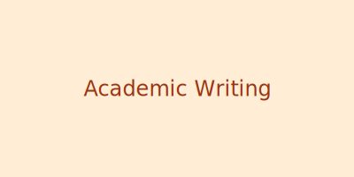

# Thoughts on Academic Writing

Writing is an essential skill in academia. Here are some tips I've learned:

- Start with an outline
- Write regularly, even if it's just a paragraph
- Get feedback early and often
- Read widely in your field

What are your writing strategies?
